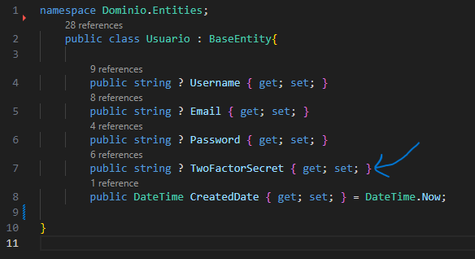
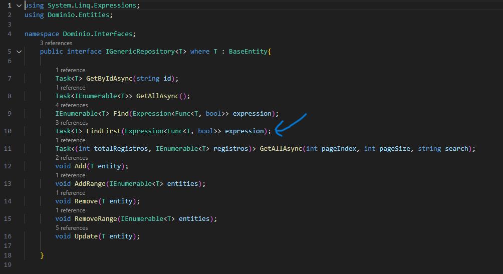
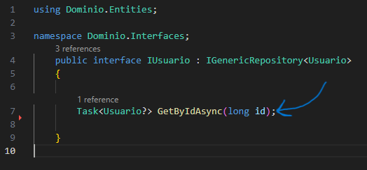

# Documentación 📄 

- ## Autenticación en dos pasos o autenticación de dos factores o 2FA
    ### Que es?
    Es un método de seguridad que requiere dos formas distintas de verificar la identidad de un usuario antes de permitirle el acceso a una cuenta o sistema.

    El objetivo de la autenticación en dos pasos es agregar una capa adicional de seguridad a las cuentas en línea, ya que incluso si alguien conoce o roba la contraseña, no podrá acceder a la cuenta sin también poseer el segundo factor de autenticación.

- ## Que fue lo que hice?
    1. Comence creando la entidad Usuario donde se va a almacenar el token secreto para la validación de los usuarios.
    
    

    2. Despues realice un metodo generico llamado FindFirst en Dominio/Interfaces/IGenericRepository que va a buscar la primera entidad en el repositorio que cumpla con la condición específica que tenemos en el repositorio.

    

    3. La condición específica a la que nos refererimos se encuentra dentro de nuestro Aplicacion/UsurarioRepository donde declaramos un método llamado GetByIdAsync que toma un parámetro id de tipo long que va a retonar una busqueda asincrónica de un usuario por su ID y el método FindAsync devuelve una tarea que representa el resultado de la búsqueda, un objeto Usuario o null.

    

    4. 

- ## Migraciones
    dotnet ef migrations add InitialCreate --project ./Persistencia/ --startup-project ./API/ --output-dir ./Data/Migrations/

    dotnet ef database update --project ./Persistencia/ --startup-project ./API/  
