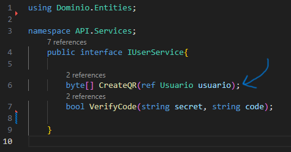
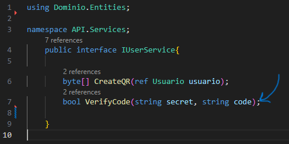

# Documentación 📄 

- ## Autenticación en dos pasos o autenticación de dos factores o 2FA
    ### Que es?
    Es un método de seguridad que requiere dos formas distintas de verificar la identidad de un usuario antes de permitirle el acceso a una cuenta o sistema.

    El objetivo de la autenticación en dos pasos es agregar una capa adicional de seguridad a las cuentas en línea, ya que incluso si alguien conoce o roba la contraseña, no podrá acceder a la cuenta sin también poseer el segundo factor de autenticación.

- ## Que fue lo que hice?

    1. Comenzamos creando la entidad Usuario con propiedades basicas y una donde se va a almacenar el token secreto para la validación de los usuarios.

        ```
        public string ? Username { get; set; }
        public string ? Email { get; set; }
        public string ? Password { get; set; }
        public string ? TwoFactorSecret { get; set; }
        public DateTime CreatedDate { get; set; } = DateTime.Now;
        ```

        

        ---

    2. Despues realizamos un metodo generico llamado FindFirst dentro de Dominio/Interfaces/IGenericRepository que va a buscar la primera entidad en el repositorio que cumpla con la condición específica que vamos a crear en el repositorio.

        ```
        Task<T> FindFirst(Expression<Func<T, bool>> expression);
        ```

        

        ---

    3. Para poder realizar la condicion tenemos que crear una interfaz de IUsuario la cual va a tener un método específico para buscar usuarios por su ID de manera asincrónica.

        ```
        Task<Usuario?> GetByIdAsync(long id);
        ```

        

        ---

    4. La condición específica a la que nos refererimos la vamos a crear dentro de Aplicacion/UsurarioRepository donde declaramos un método llamado GetByIdAsync que toma un parámetro id de tipo long que va a retonar una busqueda asincrónica de un usuario por su ID y el método FindAsync nos devuelve una tarea que representa el resultado de la búsqueda, un objeto Usuario o null.

        ```
        public async Task<Usuario?> GetByIdAsync(long id)
        {
            return await _Context.FindAsync<Usuario>(id);
        }
        ```

        

        ---

    5. Ahora procedemos a crear una interfaz llamada IUserService dentro de Extensions que definira dos métodos que están relacionados con la autenticación de dos factores:  

        El primero es:

        ```
        byte[] CreateQR(ref Usuario usuario);
        ```

        Este método se utiliza para crear un código QR basado en la información de un usuario. Toma un parámetro de referencia usuario de tipo Usuario, que representa la información del usuario que se utilizará para generar el código QR. El método devuelve un arreglo de bytes (byte[]) que representa el código QR.

        

        El segundo es:

        ```
        bool VerifyCode(string secret, string code);
        ```

        Este método se utiliza para verificar si un código proporcionado (code) coincide con el TwoFactorSecret (secret). Toma dos parámetros de cadena (string): secret, que es el TwoFactorSecret almacenado en la Entidad Usuario, y code, que es el código que el usuario ingresa para la autenticación de dos factores. El método devuelve un valor booleano (true o false) que indica si el código es válido.

        

        ---

    6. La configuración de estos metodos los creamos una clase llamada UserService que implementara la interfaz IUserService 


