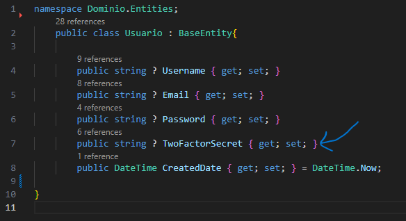
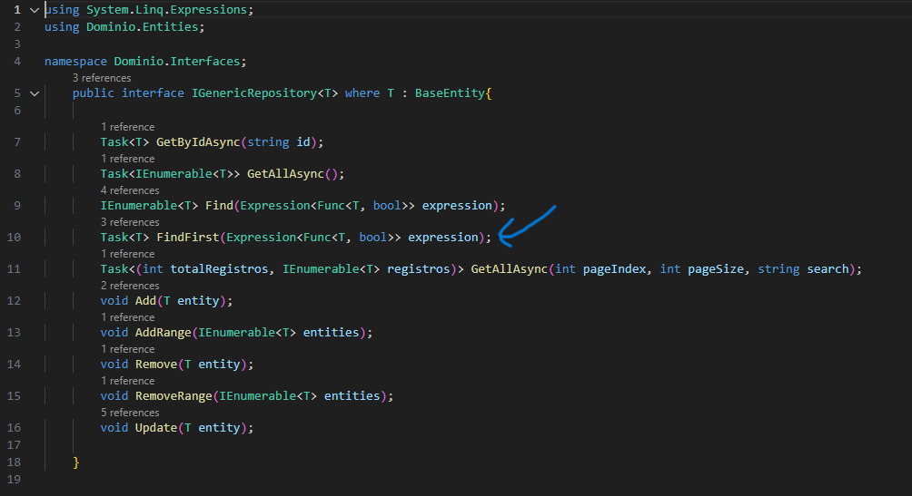
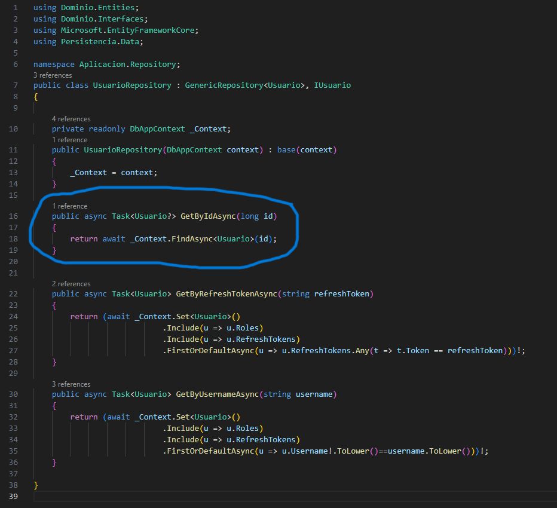
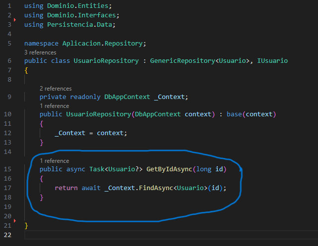
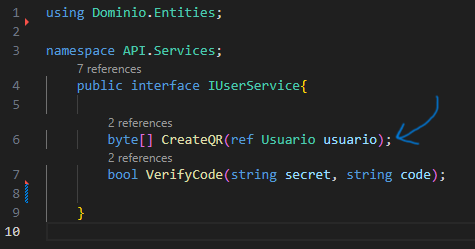
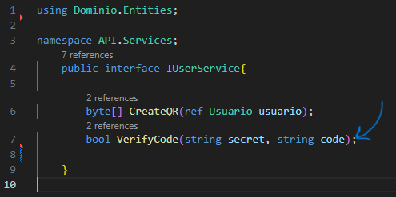
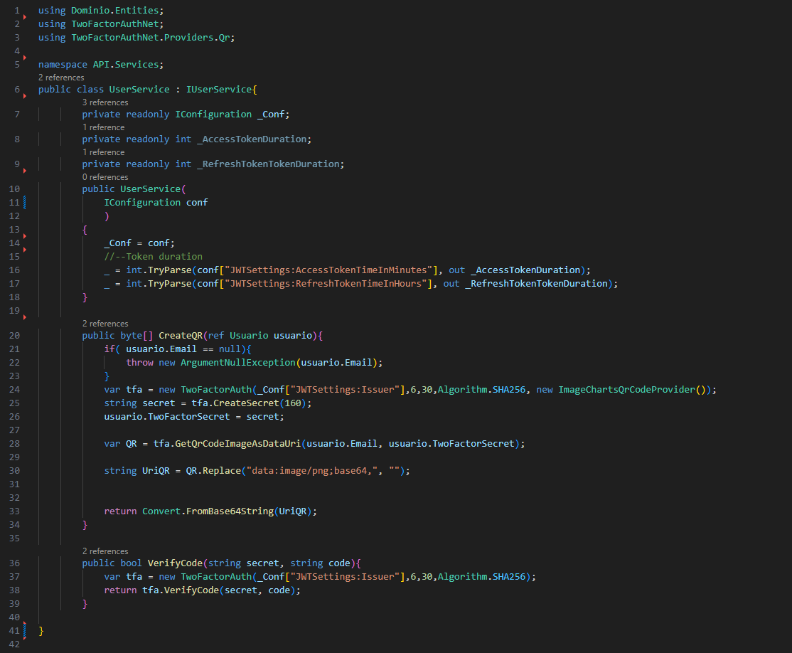
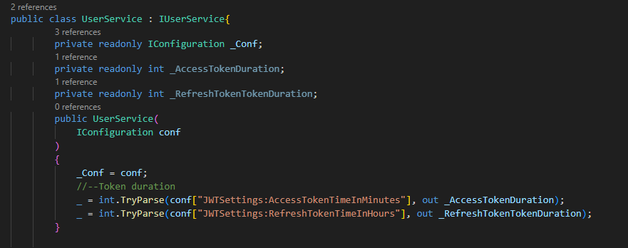
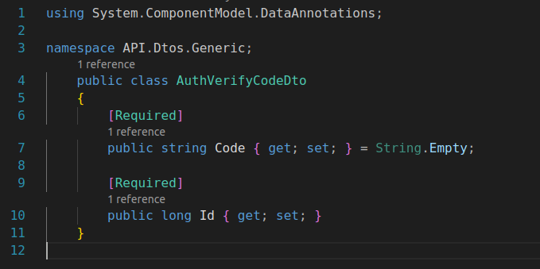
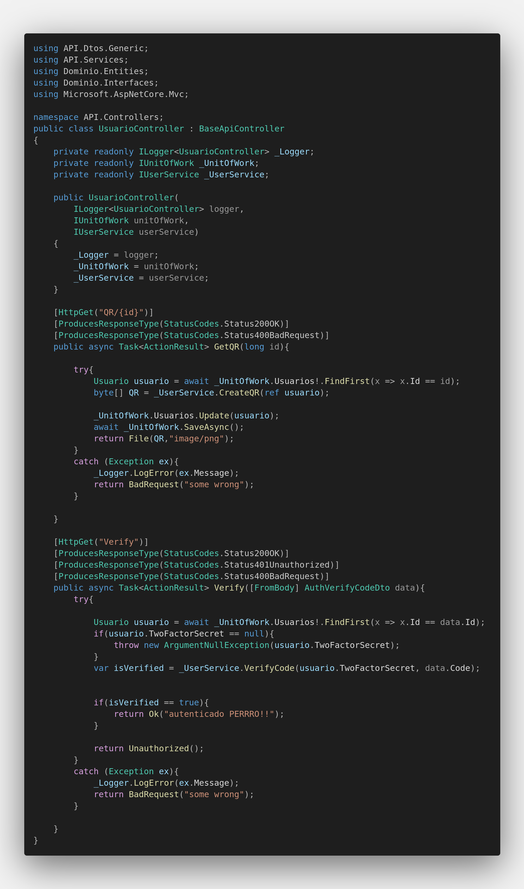

# Documentación 📄

- ## Autenticación en dos pasos o autenticación de dos factores o 2FA
    ### Que es?
    Es un método de seguridad que requiere dos formas distintas de verificar la identidad de un usuario antes de permitirle el acceso a una cuenta o sistema.

    El objetivo de la autenticación en dos pasos es agregar una capa adicional de seguridad a las cuentas en línea, ya que incluso si alguien conoce o roba la contraseña, no podrá acceder a la cuenta sin también poseer el segundo factor de autenticación.

- ## Que fue lo que hice?

    1. Comenzamos creando la entidad Usuario con propiedades basicas y una donde se va a almacenar el token secreto para la validación de los usuarios.

        ```
        public string ? Username { get; set; }
        public string ? Email { get; set; }
        public string ? Password { get; set; }
        public string ? TwoFactorSecret { get; set; }
        public DateTime CreatedDate { get; set; } = DateTime.Now;
        ```

        

        ---

    2. Despues realizamos un metodo generico llamado FindFirst dentro de Dominio/Interfaces/IGenericRepository que va a buscar la primera entidad en el repositorio que cumpla con la condición específica que vamos a crear en el repositorio.

        ```
        Task<T> FindFirst(Expression<Func<T, bool>> expression);
        ```

        

        ---

    3. Para poder realizar la condicion tenemos que crear una interfaz de IUsuario la cual va a tener un método específico para buscar usuarios por su ID de manera asincrónica.

        ```
        Task<Usuario?> GetByIdAsync(long id);
        ```

        

        ---

    4. La condición específica a la que nos refererimos la vamos a crear dentro de Aplicacion/UsurarioRepository donde declaramos un método llamado GetByIdAsync que toma un parámetro id de tipo long que va a retonar una busqueda asincrónica de un usuario por su ID y el método FindAsync nos devuelve una tarea que representa el resultado de la búsqueda, un objeto Usuario o null.

        ```
        public async Task<Usuario?> GetByIdAsync(long id)
        {
            return await _Context.FindAsync<Usuario>(id);
        }
        ```

        

        ---

    5. Ahora procedemos a crear una interfaz llamada IUserService dentro de Services que definira dos métodos que están relacionados con la autenticación de dos factores:  

        El primero es:

        ```
        byte[] CreateQR(ref Usuario usuario);
        ```

        Este método se utiliza para crear un código QR basado en la información de un usuario. Toma un parámetro de referencia usuario de tipo Usuario, que representa la información del usuario que se utilizará para generar el código QR. El método devuelve un arreglo de bytes (byte[]) que representa el código QR.

        

        El segundo es:

        ```
        bool VerifyCode(string secret, string code);
        ```

        Este método se utiliza para verificar si un código proporcionado (code) coincide con el TwoFactorSecret (secret). Toma dos parámetros de cadena (string): secret, que es el TwoFactorSecret almacenado en la Entidad Usuario, y code, que es el código que el usuario ingresa para la autenticación de dos factores. El método devuelve un valor booleano (true o false) que indica si el código es válido.

        

        ---

    6. La configuración de estos metodos los creamos una clase llamada UserService que implementara la interfaz IUserService y la utilizaremos para proporcionar funcionalidades relacionadas con la autenticación de dos factores.

        

        - Creamos el constructor que recibe una instancia de IConfiguration como parámetro, que se utiliza para acceder a la configuración de la aplicación. En este constructor, se lee la configuración relacionada con la duración de los tokens de acceso y tokens de actualización desde la configuración de la aplicación (_Conf) y se almacenan en las variables _AccessTokenDuration y _RefreshTokenTokenDuration. 

            ```
            private readonly IConfiguration _Conf;
            private readonly int _AccessTokenDuration;
            private readonly int _RefreshTokenTokenDuration;
            public UserService(
                IConfiguration conf 
            )
            {
                _Conf = conf;
                //--Token duration
                _ = int.TryParse(conf["JWTSettings:AccessTokenTimeInMinutes"], out _AccessTokenDuration);
                _ = int.TryParse(conf["JWTSettings:RefreshTokenTimeInHours"], out _RefreshTokenTokenDuration);   
            }
            ```
            

        - Ahora creamos el metodo utilizaremos para crear un código QR basado en la información de un usuario y configurar la autenticación de dos factores para ese usuario.

            - Verificamos si el campo Email del usuario no es nulo. Si es nulo, lanza una excepción.

                ```
                if( usuario.Email == null){
                throw new ArgumentNullException(usuario.Email);
                }
                ```

            - Crea una instancia de TwoFactorAuth con ciertos parámetros, incluyendo el emisor, el número de dígitos del código (6), el período (30 segundos), el algoritmo de cifrado (SHA256), y un proveedor de códigos QR basado en Image-Charts.

                ```
                var tfa = new TwoFactorAuth(_Conf["JWTSettings:Issuer"],6,30,Algorithm.SHA256, new ImageChartsQrCodeProvider());
                ```

            - Genera un secreto de autenticación de dos factores de 160 caracteres y lo asigna al campo TwoFactorSecret del usuario.

                ```
                string secret = tfa.CreateSecret(160);
                usuario.TwoFactorSecret = secret;
                ```

            - Obtiene una imagen del código QR como una cadena de datos URI.

                ```
                var QR = tfa.GetQrCodeImageAsDataUri(usuario.Email, usuario.TwoFactorSecret); 

                tring UriQR = QR.Replace("data:image/png;base64,", "");
                ```

            - Convierte la cadena de datos URI a un arreglo de bytes y lo devuelve como resultado.

                ```
                return Convert.FromBase64String(UriQR);
                ```

        - Ahora creamos un método que se utilizara para verificar si un código proporcionado (code) coincide con el TwoFactorSecret de autenticación de dos factores (secret). Utiliza la biblioteca TwoFactorAuthNet para llevar a cabo la verificación.

            ```
            public bool VerifyCode(string secret, string code){        
                var tfa = new TwoFactorAuth(_Conf["JWTSettings:Issuer"],6,30,Algorithm.SHA256);
                return tfa.VerifyCode(secret, code);
            }
            ```


        ---

    7. Ahora procedemos a crear un Dto llamado AuthVerifyCodeDto que vamos a implementar despues en el controlador de Usuario. En ella vamos a representar los datos que se envían en una solicitud HTTP, el cuerpo de la solicitud, cuando se estemos verificando un código de autenticación de dos factores.

        

        - El primer dato que vamos a solicitar es:

            ```
            [Required]
            public string Code { get; set; } = String.Empty;
            ```

            Esta propiedad representa el código de autenticación de dos factores que se debe verificar. La anotación [Required] indica que este campo es obligatorio y no puede estar vacío. La inicialización con String.Empty establece un valor predeterminado de una cadena vacía.

        - El segundo dato que vamos a solicitar es:

            ```
            [Required]
            public long Id { get; set; }
            ```

            Esta propiedad representa el identificador único (ID) del usuario al que se le está verificando el código de autenticación de dos factores. También está marcada con [Required], lo que significa que es un campo obligatorio en la solicitud.

    ---


    8. Ahora vamos a implementar lo anterior dentro de dos metodos que vamos a construir dentro del controlador de Usuario que manejara las solicitudes relacionadas con la autenticación de dos factores.

        

        1. En el constructor se inyectan las siguientes dependencias:

            - _Logger: Una instancia de un registrador de registros (ILogger) que se utiliza para registrar mensajes de registro.

            - _UnitOfWork: Una instancia de IUnitOfWork, que se utiliza para interactuar con la unidad de trabajo en la capa de acceso a datos.

            - _UserService: Una instancia de IUserService, que representa un servicio para la autenticación de dos factores.

                ```
                private readonly ILogger<UsuarioController> _Logger;
                private readonly IUnitOfWork _UnitOfWork;
                private readonly IUserService _UserService;

                public UsuarioController(
                    ILogger<UsuarioController> logger,
                    IUnitOfWork unitOfWork,
                    IUserService userService)
                {
                    _Logger = logger;
                    _UnitOfWork = unitOfWork;
                    _UserService = userService;
                }
                ```

            ---
        2. Ahora crearemos el primer metodo:

            ## Metodo 1
            - [HttpGet("QR/{id}")]  

                Este atributo en el método GetQR indica que este método responderá a las solicitudes HTTP GET en la ruta /QR/{id}, donde {id} es un parámetro de la URL. Este método lo utilizaremos para obtener el código QR relacionado con un usuario.

                ---

            - [ProducesResponseType(StatusCodes.Status200OK)]  

                Este atributo indica el código de respuesta HTTP que va a devolver este metodo en caso de éxito es (Status200OK).

                ---

            - [ProducesResponseType(StatusCodes.Status400BadRequest)]  

                Este atributo indica el código de respuesta HTTP que va a devolver este metodo en caso de error es (Status400BadRequest).

                ---

            - public async Task<ActionResult> GetQR(long id)  

                Este es el método toma un parámetro id de tipo long, que representa el ID de un usuario y dentro del bloque try va a 

                ### Bloque Try
                - Usuario usuario = await _UnitOfWork.Usuarios!.FindFirst(x => x.Id == id);  

                    Buscar un usuario en la base de datos utilizando el _UnitOfWork y el método FindFirst.

                - byte[] QR = _UserService.CreateQR(ref usuario);  
                
                    Llamar al método _UserService.CreateQR(ref usuario) para crear un código QR basado en la información del usuario.

                - _UnitOfWork.Usuarios.Update(usuario);  
                
                    Actualizar el usuario en la base de datos.

                - await _UnitOfWork.SaveAsync();  

                    Guardar los cambios en la base de datos de manera asincrónica utilizando _UnitOfWork.SaveAsync().

                - return File(QR,"image/png");  

                    Devolver el código QR como un archivo de tipo image/png en la respuesta.

                    ---

                ### Bloque Catch
                - catch (Exception ex) 

                    Si ocurre alguna excepción

                - _Logger.LogError(ex.Message);  

                    Se registra el mensaje de error utilizando _Logger

                - return BadRequest("The QR code could not be generated");  

                    Y se devuelve una respuesta HTTP 400 (BadRequest) con el mensaje "The QR code could not be generated". 

            ```
                [HttpGet("QR/{id}")]
                [ProducesResponseType(StatusCodes.Status200OK)]
                [ProducesResponseType(StatusCodes.Status400BadRequest)]    
                public async Task<ActionResult> GetQR(long id){        
                    
                    try{
                        Usuario usuario = await _UnitOfWork.Usuarios!.FindFirst(x => x.Id == id);
                        byte[] QR = _UserService.CreateQR(ref usuario);            

                        _UnitOfWork.Usuarios.Update(usuario);
                        await _UnitOfWork.SaveAsync();
                        return File(QR,"image/png");
                    }
                    catch (Exception ex){
                        _Logger.LogError(ex.Message);
                        return BadRequest("The QR code could not be generated");
                    }    
                }

            ```

            ---

            ## Metodo 2
            - [HttpGet("Verify")]  

                Este atributo en el método Verify indica que este método responderá a las solicitudes HTTP GET en la ruta /Verify. Este método se utilizara para verificar un código de autenticación de dos factores.

                ---

            - [ProducesResponseType(StatusCodes.Status200OK)]

                Este atributo indica el código de respuesta HTTP que va a devolver este metodo en caso de éxito es (Status200OK).

                ---

            - [ProducesResponseType(StatusCodes.Status401Unauthorized)]

                Este atributo indica el código de respuesta HTTP que va a devolver este metodo en caso de falta de autorización es (Status401Unauthorized).

                ---

            - [ProducesResponseType(StatusCodes.Status400BadRequest)]

                Este atributo indica el código de respuesta HTTP que va a devolver este metodo en caso de error es (Status400BadRequest).

                ---

            - public async Task<ActionResult> Verify([FromBody] AuthVerifyCodeDto data)

                Este es el método toma un objeto AuthVerifyCodeDto como entrada desde el cuerpo de la solicitud HTTP.

                ### Bloque Try

                - Usuario usuario = await _UnitOfWork.Usuarios!.FindFirst(x => x.Id == data.Id);
                
                    Busca un usuario en la base de datos utilizando _UnitOfWork y el método FindFirst en función del ID proporcionado en data.Id.

                - if(usuario.TwoFactorSecret == null){  
                throw new ArgumentNullException(usuario.TwoFactorSecret);  
                }
                
                    Verifica si el usuario tiene un secreto de autenticación de dos factores (TwoFactorSecret) no nulo. Si es nulo, se lanza una excepción.

                - var isVerified = _UserService.VerifyCode(usuario.TwoFactorSecret, data.Code);
                
                    Llama al método _UserService.VerifyCode para    verificar si el código proporcionado en data.Code coincide con el TwoFactorSecret del usuario.

                - if(isVerified == true){  
                return Ok("autenticado PERRRO!!");  
                }

                    Si la verificación es exitosa, devuelve una respuesta HTTP 200 (OK) con el mensaje "autenticado PERRRO!!".

                - return Unauthorized();

                    Si la verificación falla, devuelve una respuesta HTTP 401 (Unauthorized).

                ---

                ### Bloque Catch
                - catch (Exception ex) 

                    Si ocurre alguna excepción

                - _Logger.LogError(ex.Message);  

                    Se registra el mensaje de error utilizando _Logger

                - return BadRequest("could not authenticate");  

                    Y se devuelve una respuesta HTTP 400 (BadRequest) con el mensaje "could not authenticate".  

                ---

            ```
                [HttpGet("Verify")]
                [ProducesResponseType(StatusCodes.Status200OK)]
                [ProducesResponseType(StatusCodes.Status401Unauthorized)]    
                [ProducesResponseType(StatusCodes.Status400BadRequest)]    
                public async Task<ActionResult> Verify([FromBody] AuthVerifyCodeDto data){        
                    try{

                        Usuario usuario = await _UnitOfWork.Usuarios!.FindFirst(x => x.Id == data.Id);
                        if(usuario.TwoFactorSecret == null){
                            throw new ArgumentNullException(usuario.TwoFactorSecret);
                        }
                        var isVerified = _UserService.VerifyCode(usuario.TwoFactorSecret, data.Code);            

                        if(isVerified == true){
                            return Ok("autenticado PERRRO!!");
                        }

                        return Unauthorized();
                    }
                    catch (Exception ex){
                        _Logger.LogError(ex.Message);
                        return BadRequest("some wrong");
                    }  
                }
            ```

    ---